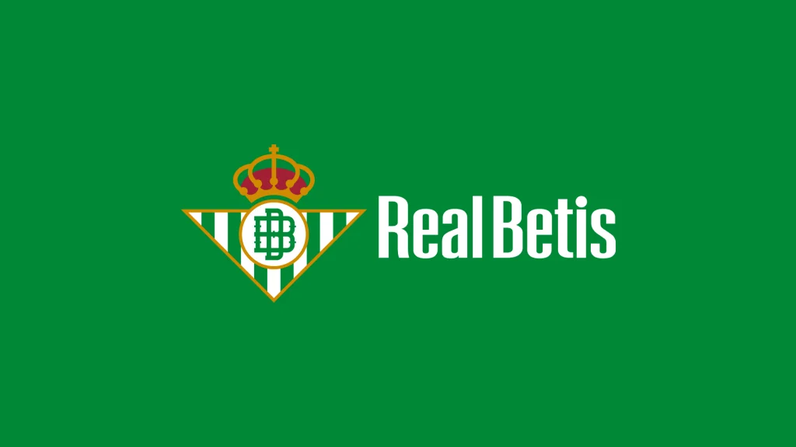
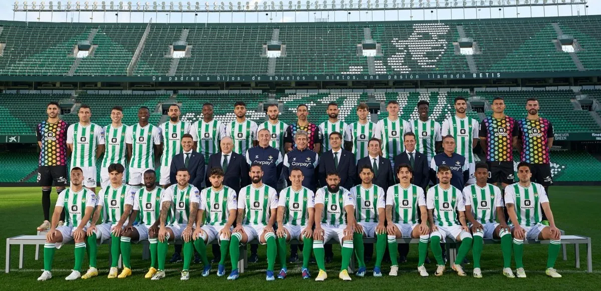
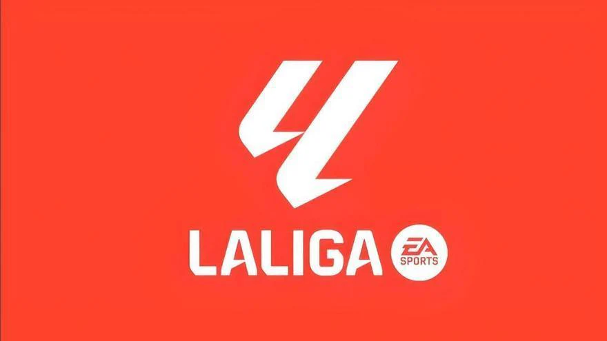
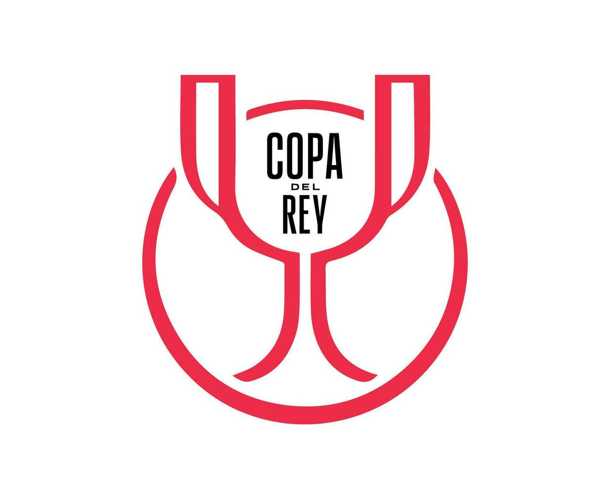

# 🟢 Real Betis Balompié – Plantilla Profesional 2025/26

---

## 📊 Datos Generales del Club

- **Nombre oficial:** Real Betis Balompié, S.A.D.  
- **Fundación:** 12 de septiembre de 1907  
- **Estadio:** Benito Villamarín (60.721 espectadores)  
- **Presidente:** Ángel Haro  
- **Director deportivo:** Manu Fajardo  
- **Entrenador:** Manuel Pellegrini  
- **Temporada actual:** 2025/26  
- **Competencias:** LaLiga EA Sports, Copa del Rey, UEFA Europa League

---

## 📋 Jugadores Destacados

| **Jugador**          | **Posición**            | **Edad** | **Dorsal** | **Contrato hasta** |
|----------------------|-------------------------|----------|------------|---------------------|
| Álvaro Valles        | Portero                 | 28 años  | 1          | 2030                |
| Isco Alarcón         | Mediocentro ofensivo    | 33 años  | 22         | 2027                |
| Marc Bartra          | Defensa central         | 34 años  | 5          | 2027                |
| Rodrigo Riquelme     | Extremo izquierdo       | 25 años  | 10         | 2030                |
| Chimy Ávila          | Delantero centro        | 31 años  | 9          | 2027                |
| William Carvalho     | Mediocentro defensivo   | 33 años  | 14         | 2026                |
| Héctor Bellerín      | Lateral derecho         | 30 años  | 2          | 2028                |

---

## 📌 Análisis Técnico

### 🔍 Perfil de la Plantilla

- **Edad media:** 30,6 años  
- **Nacionalidades representadas:** España, Argentina, Portugal, Brasil  
- **Puntos fuertes:**  
  - Consolidación defensiva con experiencia internacional  
  - Versatilidad ofensiva gracias a extremos y mediapuntas creativos  
  - Liderazgo en el campo y vestuario  

### 🧠 Jugadores Clave

- **Isco Alarcón:** Motor creativo del equipo, líder en asistencias y visión de juego.
- **Álvaro Valles:** Guardameta fiable, seguro bajo palos y clave en salidas desde atrás.
- **Rodrigo Riquelme:** Aportación diferencial por banda, desequilibrio y goles.
 

---

## 📈 Proyección y Estrategia Deportiva

El Real Betis apuesta por un modelo sostenible basado en:

- **Estabilidad contractual**: renovación de pilares hasta 2027-2030.  
- **Modelo mixto**: equilibrio entre experiencia (Isco, Carvalho) y juventud (Riquelme, Valles).  
- **Cultura de cantera** y fichajes estratégicos del mercado nacional e internacional.  
- **Continuidad táctica**: Pellegrini mantiene un 4-2-3-1 flexible, con posesión, presión alta y amplitud ofensiva.

---

## 🏟️ Objetivos Temporada 2025/26

| **Competencia** | **Objetivo** | **Imagen Representativa** |
|-----------------|--------------|----------------------------|
|    **LaLiga EA Sports** | Clasificación europea (Top 6) | 🇪🇸 Competición nacional |
|    **Copa del Rey** | Alcanzar semifinales | 🏆 Torneo eliminatorio |
|    **UEFA Europa League** | Llegar a cuartos o más | 🌍 Competición europea |

## 📎 Conclusión Profesional

La plantilla 2025/26 del **Real Betis Balompié** está diseñada para competir al más alto nivel, con un equilibrio entre rendimiento inmediato y desarrollo a medio plazo. La gestión deportiva del club refleja madurez, ambición y compromiso con una identidad de juego clara.

> "El Betis de hoy no solo compite, también convence."  
> — *Resumen técnico interno*

---

📌 *Este documento es una presentación profesional de carácter informativo. Para uso interno, institucional o de prensa especializada.*

